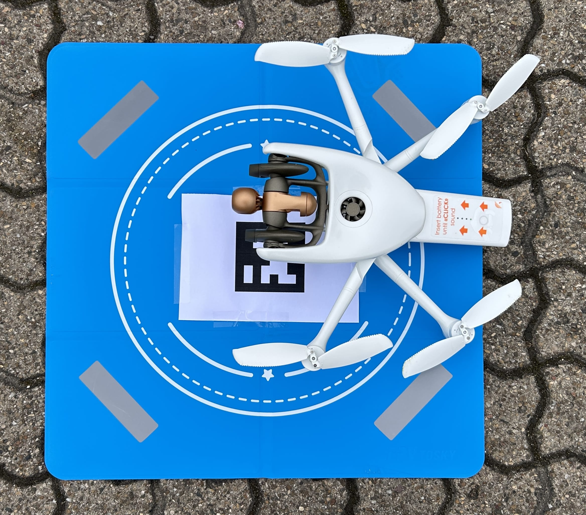
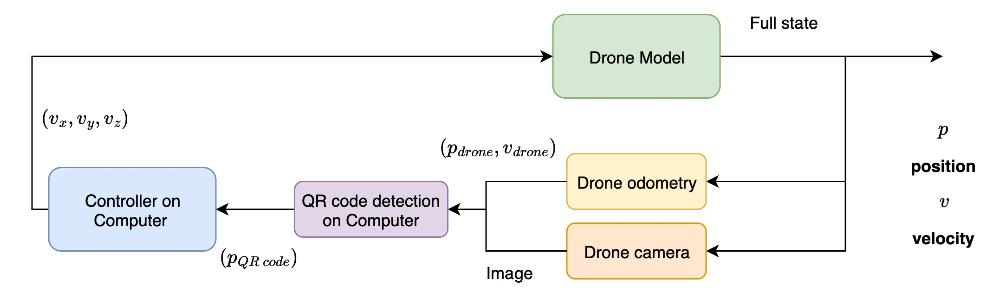

# Introduction 

## System description

The drone is a Parrot Anafi AI, controlled either via speed or via position command (performed using its internal controller). 
The drone starts a few meters above and a few meters away from the box. 
Initial strategy was to perform image recognition to locate the box, but a more robust solution was to use a QR-code to perform quick and precise recognition of the box's center:

The difficulty of the project lies in the fact that the drone is remotely controlled : computation is made on an external PC. The overall system is subject to communication delays when sending commands or receiving data from the drone. 
The data that are shared are the drone's odometry and the video flux from its camera.

Drone's internal odometry is noisy and subject to disturbances, especially when being close to the ground, this motivated the choice of using the camera for a consistant relative pose estimation. 

## Control goals

Our control goals are the following :
1. Ensure the drone lands **inside** the target
2. With less priority, ensure correct orientation of the drone when landing
